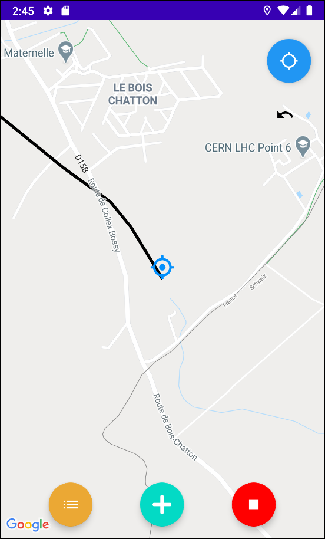

# Hike Tracker

Hike Tracker is an Android Mobile App allowing users to :

- track their hikes (path, distance, duration)
- add point of interest with pictures
- follow their previous tracks and get alerted of the different points of interest when they get close to them

**Authors :**

- Maxime Hutinet
- José Neto Gonçalves
- Justin Foltz

# The project

The project has been built with :

- Android Studio and Kotlin for the App
- SQLite for the database 

# How to run the project ?

## Requirements

To run the project, the followings must be installed on the machine :

- Android Studio 4.0.1
- Android 10.0 (Q) SDK

## Running the project

1. Import the project in Android Studio

2. Add a new configuration and select the module `app`

3. Insert your [Google Map API key](https://developers.google.com/maps/documentation/android-sdk/start#get-key) under `res > values > google_maps_api.xml` 

4. Run the project in the emulator or on your device.

Note : If you run it in the emulator, make sure you have access to internet otherwise the map won't be available.

